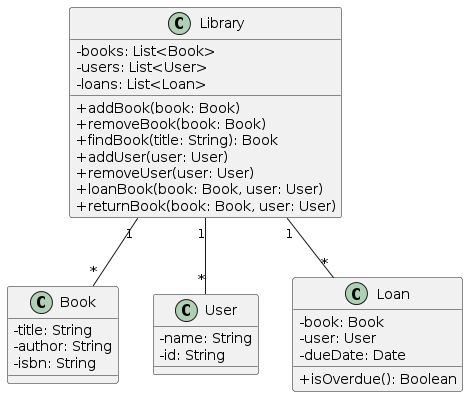

# Relatório Técnico — DR2-TP1

**Disciplina:** Design Patterns e Domain-Driven Design (DDD) com Java - DR2  
**Professor:** Alexandre Faria da Silva  
**Aluno:** André Luis Becker (becker84)  
**Instituto:** Infnet — Bloco: Engenharia de Softwares Escaláveis — Trimestre 26E2  
**Data:** Maio/2026

---

## Sistema de Gerência de Biblioteca — Refatoração com Padrões GoF

---

## 1. Diagnóstico do Sistema Original



| # | Problema                                                           | Categoria             |
|---|--------------------------------------------------------------------|-----------------------|
| 1 | `Library` instancia `Book` e `Loan` diretamente — alto acoplamento | Coupling / God Class  |
| 2 | Lógica de busca (`for + equals`) duplicada para livros e usuários  | Duplicate Code        |
| 3 | Adicionar `Dvd` exige modificar `Library` e toda lógica de busca   | Shotgun Surgery / OCP |
| 4 | `isOverdue()` consultado ativamente — sem notificação proativa     | Missing Notification  |

**Código original — God Class `Library`**

```java
public class Library {
    private List<Book> books = new ArrayList<>();
    private List<User> users = new ArrayList<>();
    private List<Loan> loans = new ArrayList<>();

    public void addBook(String title, String author, String isbn) {
        books.add(new Book(title, author, isbn)); // acoplado ao tipo concreto
    }
    public Book findBook(String title) {
        for (Book b : books) if (b.getTitle().equals(title)) return b;
        return null; // lógica de busca duplicada para cada tipo
    }
    public void loanBook(Book book, User user) {
        book.setAvailable(false);
        loans.add(new Loan(book, user, new Date()));
    }
}
```

---

## 2. Padrões de Projeto Aplicados

### 2.1 Factory Method — `FabricaItem` / `FabricaLivro` / `FabricaDvd`

**Problema resolvido:** `Biblioteca` instanciava `Livro` diretamente; adicionar `Dvd` exigia modificar múltiplas classes — violação de OCP.

**Antes**

```java
public void adicionarLivro(String titulo, String autor, String isbn) {
    livros.add(new Livro(titulo, autor, isbn)); // acoplado ao tipo concreto
}
// Adicionar DVD? Modificar Biblioteca, Emprestimo e toda lógica de busca.
```

**Depois**

```java
public abstract class FabricaItem {
    public final ItemAcervo criar(RequisicaoItem req) {
        validarRequisicao(req);
        return executarCriacao(req); // subclasse decide o tipo concreto
    }
    protected abstract ItemAcervo executarCriacao(RequisicaoItem req);
}

public final class FabricaLivro extends FabricaItem {
    protected ItemAcervo executarCriacao(RequisicaoItem req) {
        return new Livro(UUID.randomUUID().toString(),
                req.getTitulo(), req.getAutor(), req.getIsbn());
    }
}

public final class FabricaDvd extends FabricaItem {
    protected ItemAcervo executarCriacao(RequisicaoItem req) {
        return new Dvd(UUID.randomUUID().toString(),
                req.getTitulo(), req.getDiretor(), req.getDuracaoMinutos());
    }
}
```

**Justificativa:** O cliente (`FachadaBiblioteca`) opera sobre `FabricaItem` (abstração), nunca sobre `FabricaLivro` (concreção). Para adicionar `FabricaRevista`, basta criar a subclasse — nenhuma classe existente é modificada. **Princípio OCP.**

---

### 2.2 Singleton — `Biblioteca`

**Problema resolvido:** Sem garantia de instância única; múltiplas instâncias criariam estados inconsistentes do acervo.

**Implementação**

```java
public final class Biblioteca {
    private static volatile Biblioteca instancia; // volatile garante visibilidade entre threads

    private Biblioteca() {}

    public static Biblioteca getInstance() { // Double-Checked Locking — thread-safe
        if (instancia == null) {
            synchronized (Biblioteca.class) {
                if (instancia == null) instancia = new Biblioteca();
            }
        }
        return instancia;
    }

    public static void resetarParaTeste() {
        synchronized (Biblioteca.class) { instancia = null; }
    }
}
```

**Justificativa:** DCL com `volatile` garante unicidade em ambientes concorrentes — padrão recomendado por Bloch em *Java Efetivo*.

**Relação com Spring Boot:** No projeto, `FachadaBiblioteca`, `DespachadorEventos` e os repositórios são beans Spring anotados com `@Service` / `@Component` / `@Repository`. O Spring IoC container gerencia todos esses beans com escopo `singleton` por padrão — ou seja, a própria infraestrutura do framework aplica o padrão Singleton automaticamente para cada bean.

A classe `Biblioteca` demonstra o **mecanismo manual** do padrão GoF (construtor privado + DCL + `volatile`) de forma explícita e independente do container. Isso cumpre o objetivo acadêmico de mostrar domínio sobre a implementação do padrão, enquanto na prática o Spring garante a unicidade dos demais componentes. As duas abordagens coexistem intencionalmente: a classe `Biblioteca` evidencia o padrão; os beans Spring o aplicam em produção.

---

### 2.3 Facade — `FachadaBiblioteca`

**Problema resolvido:** Clientes interagiam diretamente com Singleton, Factories, algoritmos de busca e empréstimos — alto acoplamento entre camadas.

**Antes**

```java
Biblioteca bib = Biblioteca.getInstance();
Livro livro = new Livro(titulo, autor, isbn); // instanciação direta
bib.adicionarLivro(livro);
Emprestimo e = new Emprestimo(livro, usuario, new Date());
bib.emprestarLivro(livro, usuario);
```

**Depois**

```java
@Service
public class FachadaBiblioteca {
    public ItemAcervo adicionarLivro(String titulo, String autor, String isbn) { ... }
    public Emprestimo realizarEmprestimo(String itemId, String usuarioId) { ... }
    public List<ItemAcervo> buscarPorTitulo(String query) { ... }
    public List<Emprestimo> listarVencidos() { ... }
}
// ControladorBiblioteca conhece apenas FachadaBiblioteca — zero acoplamento com internos
```

**Justificativa:** `ControladorBiblioteca` interage exclusivamente com `FachadaBiblioteca`. Toda orquestração de Singleton, Factory, Observer e Strategy ocorre internamente — acoplamento externo mínimo, alta coesão interna. **Princípio SRP.**

---

### 2.4 Observer — `DespachadorEventos` / `ObservadorEmprestimo`

**Problema resolvido:** Detecção de vencimentos exigia polling manual; nenhum mecanismo proativo de notificação existia no sistema original.

**Antes**

```java
// Polling manual espalhado pelo código cliente
for (Emprestimo e : biblioteca.getEmprestimos()) {
    if (e.isVencido()) System.out.println("Vencido: " + e.getItem().getTitulo());
}
```

**Depois**

```java
public interface ObservadorEmprestimo {
    void aoEmprestimo(Emprestimo e);
    void aoVencimento(Emprestimo e);
}

@Component
public class DespachadorEventos implements SujetoEmprestimo {
    private final List<ObservadorEmprestimo> observadores = new CopyOnWriteArrayList<>();

    public void inscrever(ObservadorEmprestimo o) { observadores.add(o); }

    public void notificarVencimento(Emprestimo e) {
        observadores.forEach(o -> o.aoVencimento(e));
    }
}

@Component
public class ObservadorAtraso implements ObservadorEmprestimo {
    public void aoVencimento(Emprestimo e) {
        log.warn("EMPRÉSTIMO VENCIDO: item='{}', vencimento={}",
                e.getItem().getTitulo(), e.getDataVencimento());
    }
}
```

**Justificativa:** Novos canais de notificação (e-mail, SMS) são adicionados implementando `ObservadorEmprestimo` — nenhuma classe existente é modificada. `CopyOnWriteArrayList` garante iteração thread-safe. **Princípio OCP.**

---

### 2.5 Strategy — `EstrategiaBusca<T>` / `ContextoBusca<T>`

**Problema resolvido:** Lógica de busca duplicada para cada tipo (`buscarLivro`, `buscarUsuario`) sem abstração comum — qualquer novo critério exigia modificar classes existentes.

**Antes**

```java
public Livro buscarLivro(String titulo) {
    for (Livro l : livros) if (l.getTitulo().equals(titulo)) return l;
    return null;
}
public Usuario buscarUsuario(String nome) {
    for (Usuario u : usuarios) if (u.getNome().equals(nome)) return u;
    return null; // mesma estrutura, tipo diferente — duplicação garantida
}
```

**Depois**

```java
public interface EstrategiaBusca<T> {
    List<T> buscar(String query, List<T> lista);
}

public final class BuscaTitulo implements EstrategiaBusca<ItemAcervo> {
    public List<ItemAcervo> buscar(String query, List<ItemAcervo> lista) {
        return lista.stream()
            .filter(i -> i.getTitulo().toLowerCase().contains(query.toLowerCase()))
            .toList();
    }
}

public final class ContextoBusca<T> {
    private EstrategiaBusca<T> estrategia;
    public void definirEstrategia(EstrategiaBusca<T> e) { this.estrategia = e; }
    public List<T> buscar(String query, List<T> lista) { return estrategia.buscar(query, lista); }
}

// Troca de algoritmo em tempo de execução (Facade):
new ContextoBusca<>(new BuscaTitulo()).buscar(query, repositorioItem.findAll());
```

**Justificativa:** `ContextoBusca<T>` encapsula a variação; adicionar busca por gênero literário requer apenas `BuscaGenero` — zero mudança em classes existentes. A interface genérica elimina a duplicação estrutural. **Princípio OCP + DRY.**

---

## 3. Diagrama de Classes Refatorado

```mermaid
%%{init: {"theme": "neo-dark"}}%%
classDiagram
    direction TB

    %% ═══════════════════════════════════════════
    %% NAMESPACE: controlador
    %% ═══════════════════════════════════════════
    namespace controlador {
        class ControladorBiblioteca {
            +adicionarLivro(req) RespostaItem
            +adicionarDvd(req) RespostaItem
            +removerItem(id) void
            +listarItens() List~RespostaItem~
            +adicionarUsuario(req) RespostaUsuario
            +realizarEmprestimo(req) RespostaEmprestimo
            +registrarDevolucao(id) void
            +listarVencidos() List~RespostaEmprestimo~
        }
    }

    %% ═══════════════════════════════════════════
    %% NAMESPACE: servico
    %% ═══════════════════════════════════════════
    namespace servico {
        class FachadaBiblioteca {
            <<Facade>>
            +adicionarLivro(titulo, autor, isbn) ItemAcervo
            +adicionarDvd(titulo, diretor, duracao) ItemAcervo
            +removerItem(id) void
            +listarItens() List~ItemAcervo~
            +adicionarUsuario(nome, email) Usuario
            +removerUsuario(id) void
            +listarUsuarios() List~Usuario~
            +realizarEmprestimo(itemId, usuarioId) Emprestimo
            +registrarDevolucao(emprestimoId) void
            +listarVencidos() List~Emprestimo~
            +buscarPorTitulo(query) List~ItemAcervo~
            +buscarPorAutor(query) List~ItemAcervo~
            +buscarPorIsbn(isbn) List~ItemAcervo~
            +buscarUsuariosPorNome(query) List~Usuario~
        }
    }

    %% ═══════════════════════════════════════════
    %% NAMESPACE: padrao.singleton
    %% ═══════════════════════════════════════════
    namespace padrao_singleton {
        class Biblioteca {
            <<Singleton>>
            -instancia$ Biblioteca
            +getInstance()$ Biblioteca
            +resetarParaTeste()$ void
        }
    }

    %% ═══════════════════════════════════════════
    %% NAMESPACE: padrao.factory
    %% ═══════════════════════════════════════════
    namespace padrao_factory {
        class FabricaItem {
            <<abstract>>
            +criar(req RequisicaoItem) ItemAcervo
            #validarRequisicao(req)* void
            #executarCriacao(req)* ItemAcervo
        }
        class FabricaLivro {
            #validarRequisicao(req) void
            #executarCriacao(req) ItemAcervo
        }
        class FabricaDvd {
            #validarRequisicao(req) void
            #executarCriacao(req) ItemAcervo
        }
        class RequisicaoItem {
            -titulo String
            -autor String
            -isbn String
            -diretor String
            -duracaoMinutos int
            +paraLivro(titulo)$ Builder
            +paraDvd(titulo)$ Builder
        }
    }

    %% ═══════════════════════════════════════════
    %% NAMESPACE: padrao.observer
    %% ═══════════════════════════════════════════
    namespace padrao_observer {
        class ObservadorEmprestimo {
            <<interface>>
            +aoEmprestimo(e Emprestimo) void
            +aoDevolucao(e Emprestimo) void
            +aoVencimento(e Emprestimo) void
        }
        class SujetoEmprestimo {
            <<interface>>
            +inscrever(o ObservadorEmprestimo) void
            +cancelarInscricao(o ObservadorEmprestimo) void
            +notificarCriacao(e Emprestimo) void
            +notificarDevolucao(e Emprestimo) void
            +notificarVencimento(e Emprestimo) void
        }
        class DespachadorEventos {
            -observadores List~ObservadorEmprestimo~
        }
        class ObservadorAtraso {
            +aoEmprestimo(e) void
            +aoDevolucao(e) void
            +aoVencimento(e) void
        }
    }

    %% ═══════════════════════════════════════════
    %% NAMESPACE: padrao.strategy
    %% ═══════════════════════════════════════════
    namespace padrao_strategy {
        class EstrategiaBusca {
            <<interface>>
            +buscar(query, lista) List~T~
        }
        class ContextoBusca {
            -estrategia EstrategiaBusca
            +definirEstrategia(e EstrategiaBusca) void
            +buscar(query, lista) List~T~
        }
        class BuscaTitulo {
            +buscar(query, lista) List~ItemAcervo~
        }
        class BuscaAutor {
            +buscar(query, lista) List~ItemAcervo~
        }
        class BuscaIsbn {
            +buscar(query, lista) List~ItemAcervo~
        }
        class BuscaNomeUsuario {
            +buscar(query, lista) List~Usuario~
        }
    }

    %% ═══════════════════════════════════════════
    %% NAMESPACE: modelo
    %% ═══════════════════════════════════════════
    namespace modelo {
        class ItemAcervo {
            <<abstract>>
            #id String
            #titulo String
            #disponivel boolean
            +retirar() void
            +devolver() void
            +getTipo()* String
            +getDescricao()* String
        }
        class Livro {
            -autor String
            -isbn String
        }
        class Dvd {
            -diretor String
            -duracaoMinutos int
        }
        class Usuario {
            -id String
            -nome String
            -email String
        }
        class Emprestimo {
            -id String
            -dataEmprestimo LocalDate
            -dataVencimento LocalDate
            -dataDevolucao LocalDate
            -status StatusEmprestimo
            +isVencido() boolean
            +registrarDevolucao() void
        }
        class StatusEmprestimo {
            <<enumeration>>
            ATIVO
            DEVOLVIDO
            VENCIDO
        }
    }

    %% ═══════════════════════════════════════════
    %% RELAÇÕES ENTRE NAMESPACES (vertical)
    %% ═══════════════════════════════════════════

    ControladorBiblioteca --> FachadaBiblioteca : usa

    FachadaBiblioteca ..> Biblioteca           : usa Singleton
    FachadaBiblioteca ..> FabricaItem          : delega criação
    FachadaBiblioteca ..> DespachadorEventos   : dispara eventos
    FachadaBiblioteca ..> ContextoBusca        : delega busca

    FabricaItem <|-- FabricaLivro
    FabricaItem <|-- FabricaDvd
    FabricaLivro ..> Livro  : cria
    FabricaDvd   ..> Dvd    : cria
    FabricaItem  ..> RequisicaoItem : usa

    SujetoEmprestimo <|.. DespachadorEventos
    ObservadorEmprestimo <|.. ObservadorAtraso
    DespachadorEventos o-- ObservadorEmprestimo : observadores

    EstrategiaBusca <|.. BuscaTitulo
    EstrategiaBusca <|.. BuscaAutor
    EstrategiaBusca <|.. BuscaIsbn
    EstrategiaBusca <|.. BuscaNomeUsuario
    ContextoBusca --> EstrategiaBusca : delega

    ItemAcervo <|-- Livro
    ItemAcervo <|-- Dvd
    Emprestimo --> ItemAcervo      : item
    Emprestimo --> Usuario         : usuario
    Emprestimo --> StatusEmprestimo : status
```



---

## 4. Mapeamento Problema → Solução

| Problema Original                        | Padrão Aplicado    | Como resolve                                                                                                         |
|------------------------------------------|--------------------|----------------------------------------------------------------------------------------------------------------------|
| Sem instância única garantida            | **Singleton**      | DCL + `volatile`; `Biblioteca.getInstance()` demonstra unicidade; Spring IoC gerencia demais beans como singletons  |
| Instanciação direta viola OCP            | **Factory Method** | Extensão por subclasse; `FabricaLivro`/`FabricaDvd` criam tipos sem alterar código existente                        |
| God Class com acesso direto de clientes  | **Facade**         | `FachadaBiblioteca` é o único entry-point; Factory, Observer e Strategy encapsulados internamente                   |
| Polling manual para detectar vencimentos | **Observer**       | Notificação push automática via `DespachadorEventos`; novos observers por extensão — princípio OCP                  |
| Lógica de busca duplicada por tipo       | **Strategy**       | Algoritmos intercambiáveis em runtime; `ContextoBusca<T>` genérico elimina duplicação — princípio DRY               |

---

## 5. Referências

- FREEMAN, Eric; ROBSON, Elisabeth. *Use a Cabeça! Padrões de Projetos*. 2. ed. Rio de Janeiro: Alta Books, 2022. ISBN 978-65-5956-022-6.
- GAMMA, Erich et al. *Padrões de Projeto: Soluções Reutilizáveis de Software Orientado a Objetos*. Porto Alegre: Bookman, 2007. ISBN 978-85-363-0606-4.
- MARTIN, Robert C. *Código Limpo: Habilidades Práticas do Agile Software*. Rio de Janeiro: Alta Books, 2011. ISBN 978-85-7608-437-4.
- FOWLER, Martin. *Refatoração: Aperfeiçoando o Design de Códigos Existentes*. 2. ed. Porto Alegre: Bookman, 2020. ISBN 978-85-8055-391-3.
- EVANS, Eric. *Domain-Driven Design: Atacando as Complexidades no Coração do Software*. Rio de Janeiro: Alta Books, 2016. ISBN 978-85-7608-872-3.
- BLOCH, Joshua. *Java Efetivo*. 3. ed. Rio de Janeiro: Alta Books, 2019. ISBN 978-85-508-0036-7.
